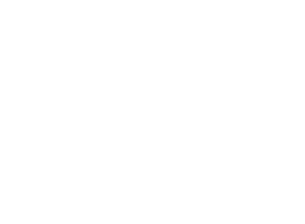
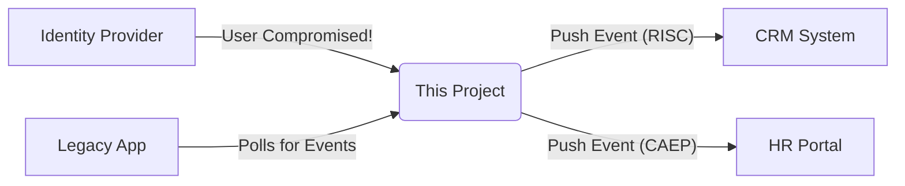

# OpenID Shared Signals Transmitter

<p align="center">
  
  <br>
  <i>The "Nervous System" for Modern Identity Security</i>
</p>

[](https://opensource.org/licenses/Apache-2.0)
[](https://jdk.java.net/21/)
[](https://spring.io/projects/spring-boot)
[](https://openid.net/wg/sharedsignals/)

An enterprise-grade implementation of the **Shared Signals Framework (SSF)** is provided by this project. It is designed to ensure that critical security events—such as account takeovers or session revocations—are instantly broadcast to all dependent applications, maintaining a unified security posture across the entire ecosystem.

The system is built with **Java 21** and **Spring Boot 3.4**, with a primary focus on reliability, scalability, and zero data loss.

---

## 💡 The Concept

In a distributed environment, interactions occur across numerous applications. Typically, if a user's account is compromised in an Identity Provider (IdP), downstream applications are not notified immediately.

**Shared Signals** addresses this by establishing a standard mechanism for broadcasting security events.

### How it works (Conceptual View)



1.  **Trigger:** A security event occurs (e.g., password stolen, session revoked).
2.  **Process:** This transmitter receives the trigger, validates it, and signs a secure JWT (Security Event Token).
3.  **Broadcast:** It instantly pushes this signal to subscribers or queues it for polling.

-----

## 🛠️ Technical Capabilities

We designed this system to be **production-hardened** for high-throughput environments.

### 🛡️ Reliability & Zero Data Loss

* **Transactional Outbox Pattern:** Events are never sent directly from memory. They are first persisted to the database within the same transaction as your business logic. If the server crashes, the event is safe and will be retried automatically upon recovery.
* **Distributed Locking (ShedLock):** Cluster-ready out of the box. Our distributed scheduler ensures that jobs (like push retries or buffer cleanup) never conflict across multiple running instances.

### ⚡ High Performance

* **Non-Blocking Async Polling:** Implements RFC 8936 using Java 21's `CompletableFuture`. Capable of handling thousands of simultaneous poll requests without blocking server threads.
* **Smart Rate Limiting:** Protects your management API from abuse while allowing burst traffic for authorized internal systems.

### 🔐 Enterprise Security

* **JWK Persistence:** Supports static signing keys configuration. You can restart, redeploy, or scale the application without breaking signature verification for your receivers.
* **DoS Protection:** Includes deep validation logic to prevent "Nested JSON" attacks and payload overflows.

-----

## 📡 Supported Events (Full Compliance)

This implementation fully supports the standard event types defined in the OpenID **CAEP 1.0** and **RISC 1.0** specifications.

| Profile | Event Type | Description |
| :--- | :--- | :--- |
| **CAEP** | `session-revoked` | The user's session was ended. |
| **CAEP** | `credential-change` | Password or 2FA method changed. |
| **CAEP** | `token-claims-change` | User attributes (e.g., role) changed. |
| **CAEP** | `assurance-level-change` | NIST authentication level changed. |
| **CAEP** | `device-compliance-change` | Device is no longer compliant (e.g., OS outdated). |
| **RISC** | `account-disabled` | The user account was disabled. |
| **RISC** | `account-enabled` | The user account was re-enabled. |
| **RISC** | `account-purged` | The user account was permanently deleted. |
| **RISC** | `credential-compromise` | Credentials are known to be stolen. |
| **RISC** | `account-credential-change-required` | User must change password on next login. |
| **RISC** | `identifier-changed` | The user's primary ID (email/sub) changed. |
| **RISC** | `opt-out` | User opted out of risk sharing. |
| **RISC** | `recovery-activated` | Account recovery flow started. |
| **RISC** | `recovery-information-changed` | Recovery email/phone changed. |
| **SSF** | `verification` | Control plane event to verify stream health. |
| **SSF** | `stream-updated` | Notification that the stream status has changed. |

-----

## 🏗️ Architecture

The project follows **Clean Architecture** principles, organized into a multi-module Maven project to enforce separation of concerns:

| Module | Purpose |
| :--- | :--- |
| **`sharedsignals-api`** | Pure domain contracts, Models, and Interfaces. No external dependencies. |
| **`sharedsignals-core`** | Business logic, validation rules, and SSF state machine. |
| **`sharedsignals-persistence-jpa`** | Data access implementation (Entities, Repositories). |
| **`sharedsignals-spring-web`** | REST API layer, Schedulers, Interceptors, and Controllers. |
| **`sharedsignals-boot`** | Application assembly, configuration wiring, and startup logic. |

-----

## 🚀 Getting Started

### Prerequisites

* **Java 21** (LTS) or higher
* Maven 3.8+
* Docker (Optional, for database)

### Configuration

Edit `sharedsignals-boot/src/main/resources/application.yml`.

> **Critical for Production:** You must configure a persistent signing key to ensure continuity.

```yaml
sharedsignals:
  issuer: "http://localhost:8080"
  security:
    # Base64 encoded RSA Private Key (PKCS#8)
    # Generate via: openssl genpkey -algorithm RSA -out priv.pem -pkeyopt rsa_keygen_bits:2048
    signing-key: "MIIEvQIBADANBgkqhkiG9w0BAQEFAASCBKcwggSjAgEAAoI..."
    signing-key-id: "my-prod-key-1"
  features:
    push-delivery-enabled: true
    event-buffer-cleanup-enabled: true
```

### Build & Run

```bash
# Verify Java version
java -version  # Should be 21+

# Build the project
mvn clean install

# Run the application
mvn spring-boot:run -pl sharedsignals-boot
```

-----

## 📖 Quick Usage

The application runs on `http://localhost:8080` by default.

### 1\. Discovery (The "Handshake")

Receivers start here to learn your public keys and endpoints.

```bash
curl -X GET http://localhost:8080/.well-known/ssf-configuration
```

### 2\. Create a Stream (Push Delivery)

A Receiver asks to listen for events via a Webhook.

```bash
curl -X POST http://localhost:8080/ssf/stream \
  -H "Content-Type: application/json" \
  -H "Authorization: Bearer <TOKEN>" \
  -d '{
    "delivery": {
      "method": "urn:ietf:rfc:8935",
      "endpoint_url": "[https://receiver.example.com/events](https://receiver.example.com/events)"
    },
    "events_requested": [
      "[https://schemas.openid.net/secevent/risc/event-type/account-disabled](https://schemas.openid.net/secevent/risc/event-type/account-disabled)"
    ]
  }'
```

### 3\. Add a Subject

Tell the stream *who* to watch (e.g., `user@example.com`).

```bash
curl -X POST http://localhost:8080/ssf/subject/add \
  -H "Content-Type: application/json" \
  -d '{
    "stream_id": "<STREAM_ID>",
    "subject": {
      "format": "email",
      "email": "user@example.com"
    }
  }'
```

### 4\. Trigger Verification (Test)

Manually trigger a control event to verify the connection.

```bash
curl -X POST http://localhost:8080/ssf/verification \
  -H "Content-Type: application/json" \
  -d '{
    "stream_id": "<STREAM_ID>",
    "state": "test-connectivity-123"
  }'
```

-----

## 🤝 Contributing

Contributions are welcome\! Please open an issue to discuss proposed changes before submitting a Pull Request.

1.  Fork the repository.
2.  Create your feature branch (`git checkout -b feature/amazing-feature`).
3.  Commit your changes (`git commit -m 'Add some amazing feature'`).
4.  Push to the branch (`git push origin feature/amazing-feature`).
5.  Open a Pull Request.

## 📄 License

This project is licensed under the [Apache 2.0 License](https://www.google.com/search?q=LICENSE).

-----

*Built with ❤️ following the OpenID Shared Signals Working Group specifications.*